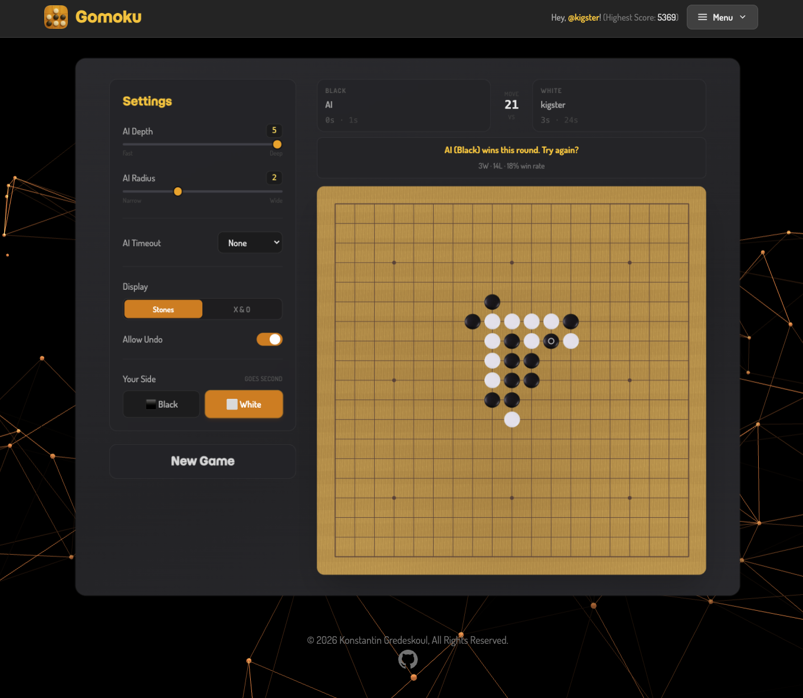

# 02 — Human vs AI on the Web

The web flow is the same C engine that ships in the TUI, fronted by a
React SPA and a FastAPI service. Auth, scoring, and persistence live
in PostgreSQL; engine moves are proxied to a pool of stateless
`gomoku-httpd` workers behind envoy.



Play it at **<https://app.gomoku.games>**.

## Game flow

1. Sign up or log in. The first visit also drops a no-secret name
   prompt so we can address you in headlines and the leaderboard.
1. Adjust the difficulty (the default is fine).
1. Click **Start Game** — the SPA calls `POST /game/start` so the
   counter ticks, then waits for your first move.
1. Every move you make is `POST`ed to `/game/play`. The FastAPI
   server proxies the JSON game state to `gomoku-httpd` (round-robin
   across workers), receives the engine's move, and returns it to
   the SPA, which drops the stone on the board.
1. On a win, draw, or resign, the SPA `POST`s `/game/save`. The
   server records the result and updates your rating (see [Scoring
   and rating](#scoring-and-rating) below).

The whole loop is short-poll request/response — no websockets — so
the same code runs unchanged on Cloud Run, Fly, ECS, or a single VPS.

## Difficulty: depth, radius, timeout

The Settings panel exposes three knobs. They map directly onto the
engine's CLI flags ([doc/01-human-vs-ai-tui.md](../004.terminal-ai-game-binary.done/plan.md)):

| Setting | Range | What it does |
|---|---|---|
| **AI Search Depth** | 2–5 | How many plies of alpha-beta look-ahead. Each extra ply roughly squares the work the engine does. Depth 2 is "novice", depth 5 is "competent club player". The TUI binary supports up to 10; the web flow caps at 5 so a single move never exceeds the per-move budget on a Cloud Run worker. |
| **AI Search Radius** | 1–4 | Distance (in board cells) around existing stones the candidate-move generator considers. Radius 1 only looks at adjacent intersections (myopic); radius 4 considers far-jump setups but searches many more candidates. Default 3 is balanced. |
| **AI Timeout** | none / 30 / 60 / 120 / 300 s | Wall-clock cap per AI move. When the clock fires the engine returns its best move so far. With no timeout, depth controls everything. |

Two extra settings round out the panel:

- **Game Display** — black/white stones (Go-style) or X/O (paper
  style). Pure cosmetics.
- **Side** — pick X (Black, moves first) or O (White). If you pick
  O, the engine plays the first move automatically.

A neat corollary: at depth 5, radius 3, no timeout, the engine on a
single Cloud Run instance spends 1–4 s on a typical mid-game move.
That's the upper bound of what feels responsive in a browser; pushing
depth or radius further trades responsiveness for strength.

## Architecture

```
Browser (React)
   |
   v
nginx (TLS) ----> FastAPI (auth, scoring, leaderboard, /game/play proxy)
                    |
                    +---> envoy (least-request) ---> gomoku-httpd worker pool
                    |
                    +---> PostgreSQL (users, games, leaderboard view)
```

Each `gomoku-httpd` worker is single-threaded by design — it pegs one
core when active and idles otherwise. envoy's least-request load
balancer handles the fan-out, so the API stays a thin proxy and never
holds long-running connections.

## Scoring and rating

When you win or lose an AI game, the result is recorded in `games` and
your Elo rating is updated immediately. The system is **calibrated to
match Gomocup's BayesElo** parameters (`eloAdvantage=0`,
`eloDraw=0.01`) — the live update uses the standard classical Elo
formula with no first-move advantage and treats draws as
half-points. See [`api/app/elo.py`](../api/app/elo.py) for the
implementation and [doc/gomocup-elo-rankings.md](../../reference/gomocup-bayesian-elo-system.md)
for the long-form design (including the planned weekly BayesElo
recalibration job).

The legacy "score" field (`1000*depth + 50*radius + time_bonus`) is
still written to each game row so older tooling keeps working, but the
**leaderboard ranks by Elo**.

The Elo system models each AI difficulty tier as its own rated
opponent — playing depth-5 is "stronger" than depth-3, so a win
against depth-5 grants more rating than a win against depth-3, and
losses are scored symmetrically. Multiplayer games rate against your
human opponent's actual rating; see
[doc/03-human-vs-human-web.md](../006.web-multiplayer-invite-flow.done/plan.md).

The leaderboard at <https://app.gomoku.games> only ranks AI games for
now (the modal carries an explicit "Only games of humans vs AI are
counted" note); multiplayer games show up in your personal history
but don't affect the public ranking.

## Game history

The **History** menu shows your most recent 100 games with score,
date, depth/radius, your time, your opponent's time, and the
opponent's name (or "AI"). Each row has a download icon that fetches
the raw game JSON — the same format the TUI saves with `-j FILE`.
Drop it back into `bin/gomoku -p FILE` to replay.

## API endpoints used

| Path | Purpose |
|---|---|
| `POST /auth/signup` | Create account |
| `POST /auth/login` | Login, returns JWT |
| `POST /game/start` | Increment the user's started-games counter |
| `POST /game/play` | Send game state, get the AI's move back |
| `POST /game/save` | Save completed game with score / rating delta |
| `GET /game/history` | Personal game list (AI + multiplayer combined) |
| `GET /leaderboard` | Top 100 AI scores worldwide |
| `GET /user/me` | Profile + personal best |

Every endpoint except `/auth/*` and `/leaderboard` requires a
`Authorization: Bearer <jwt>` header.

## See also

- [doc/01-human-vs-ai-tui.md](../004.terminal-ai-game-binary.done/plan.md) — same engine,
  CLI flavour.
- [doc/03-human-vs-human-web.md](../006.web-multiplayer-invite-flow.done/plan.md) — the
  multiplayer flow, Elo against humans.
- [doc/gomocup-elo-rankings.md](../../reference/gomocup-bayesian-elo-system.md) — Elo design.
- [frontend/CLAUDE.md](../frontend/CLAUDE.md) — frontend architecture.
