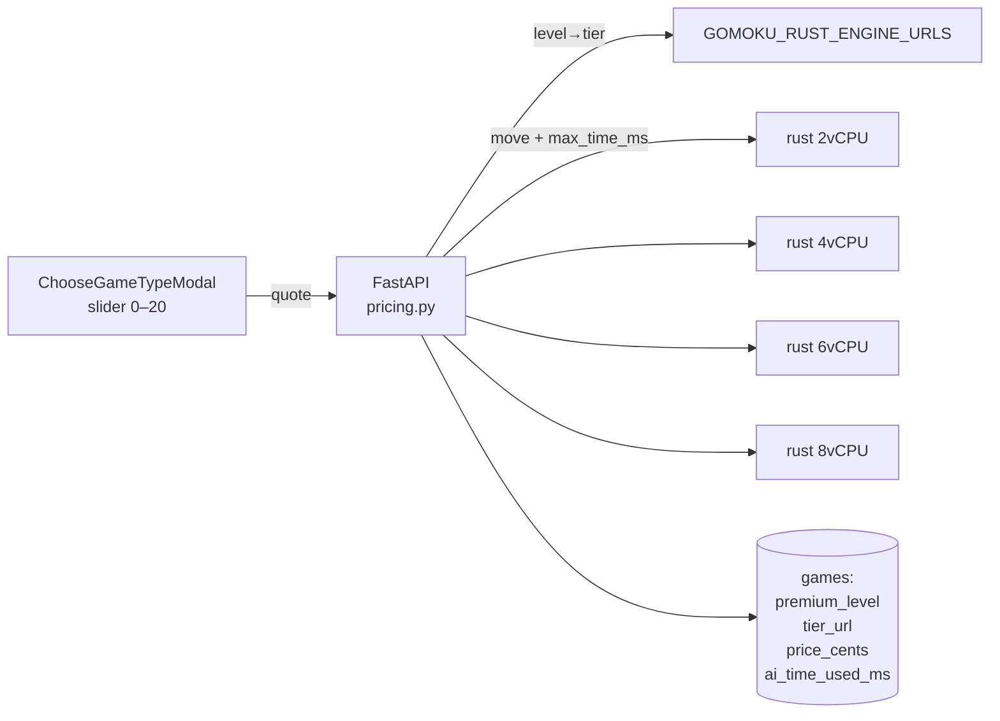

# Advanced Mode Premium Pricing — Implementation Plan

Derived from `spec.md`. Owner: Zeus (architecture) with Jeff Dean review before implementation begins.

## 1. Architecture at a glance

The feature is a thin pricing + routing layer over machinery that PR #120 already deployed: per-vCPU Cloud Run services for the Rust engine, an IAM-only invoker, and the `GOMOKU_RUST_ENGINE_URLS` tier map in the api. New work is one pure pricing function, one quote endpoint, three game columns, a per-move time-budget parameter on the Rust engine, and the slider UI.



## 2. Pricing module (api)

`api/app/services/pricing.py` — pure, no I/O:

```python
PREMIUM_LEVEL_COEFFICIENT_CENTS = 25      # from env, Terraform-owned
GAME_COMPUTE_CAP_MS = 60_000
PER_MOVE_BUDGET_MS = lambda level: min(250 * level, 5_000)

def price_cents(level: int) -> int        # max(25·L, ceil(1.5·cost_cents(L)))
def vcpu_tier(level: int) -> int          # {2..3:2, 4..7:4, 8..11:6, 12..20:8}
def cost_cents(level: int) -> float       # 60s × $0.00002525 × tier, documentation-grade
```

Unit tests enumerate all 21 levels; golden values asserted ($0.50 … $5.00).

## 3. Schema (Alembic)

`games` gains:

| column | type | notes |
| ------ | ---- | ----- |
| `premium_level` | `smallint NULL` | NULL = classic game |
| `premium_tier_url` | `text NULL` | pinned at start |
| `price_cents` | `int NULL` | quoted & recorded |
| `ai_time_used_ms` | `int NOT NULL DEFAULT 0` | budget metering |

Constraint: `premium_level BETWEEN 2 AND 20 OR premium_level IS NULL`.

## 4. API endpoints

- `GET /premium/quote?level=L` → `{level, vcpus, price_cents, per_move_budget_ms}`; 422 outside 0–20; levels 0–1 → `{price_cents: 0, engine: "c"}`.
- `POST /game/start` accepts `premium_level`; resolves tier URL from the env map, persists the four columns, emits Honeycomb attrs `premium.level`, `premium.tier`.
- `POST /game/play` routes premium games to `premium_tier_url`, passes `max_time_ms`, adds the move's reported think-time to `ai_time_used_ms`; past 60 000 ms it sends `max_time_ms=50` (instant) and flags `boost_spent: true` in the response.
- Feature flag `PREMIUM_ENABLED` (env, default false in production until payments ship).

## 5. Rust engine

`gomoku-httpd-rust` accepts `max_time_ms` in the play request (alongside depth/radius), plumbs it into iterative-deepening cutoff, and reports `time_used_ms` in the response. Default (absent) keeps current behavior. Unit + doc tests; the C engine is untouched.

## 6. Terraform / deploy

- `rust_tiers` default becomes `{2, 4, 6, 8}` (adds the 6-vCPU tier; 8 already at memory minimum 4Gi).
- Rename `premium_vcpu_coefficient` → `premium_level_coefficient` (default `0.25`), surfaced to the api as `PREMIUM_LEVEL_COEFFICIENT`.
- `bin/deploy` passes the flag; no image changes beyond the Rust request field.

## 7. Frontend

- `ChooseGameTypeModal`: third card "Advanced Mode ⚡" → slider 0–20 (Tailwind, native `input[type=range]` styled), live `$X.XX` from the quote endpoint (debounced), level descriptions ("2 vCPU · 0.5s/move" …).
- Game HUD: small "boost" meter showing remaining compute budget; "boost spent" toast at exhaustion.
- vitest: slider→quote wiring, price formatting, boundary levels (0, 1, 2, 20).

## 8. Test plan

| Layer | Test |
| ----- | ---- |
| api unit | pricing golden table, tier map, quote validation, budget accounting |
| api integration | premium game start→play routes to a mocked tier URL with `max_time_ms` |
| rust | `max_time_ms` honored within tolerance; `time_used_ms` reported |
| e2e (cypress) | quote shown for L=4 equals $1.00; play a move; span attrs present |

## 9. Sequencing (one PR per phase)

1. **Pricing + schema + quote endpoint** (api only, flag off) — v3.4.0
1. **Rust `max_time_ms` + api routing/budget** — v3.5.0
1. **Frontend slider + HUD** — v3.6.0
1. **Terraform tier/coefficient changes + flag on in staging** — v3.7.0

## Verifier notes (Jeff Dean)

_Reserved. To be filled during pre-implementation review: concurrency of `ai_time_used_ms` updates (single UPDATE … RETURNING, no read-modify-write), quote/charge TOCTOU when the coefficient changes mid-game (price is persisted at start — verify), and what happens when a tier service cold-starts longer than the per-move budget (startup probe + first-move grace)._
