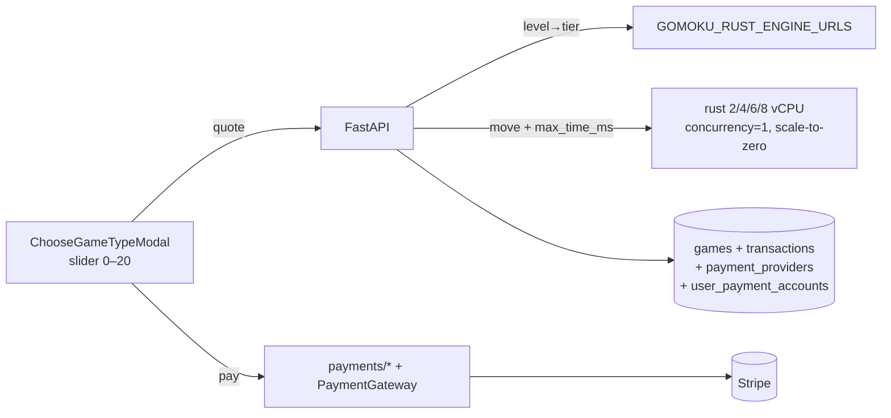

# Premium Advanced Mode — Implementation Plan (reconciled, consolidated)

> Derived from the reconciled `spec.md` in this directory. Merges **PR #121**'s
> pricing/level design, **PR #120**'s deployed infrastructure, and Feature 000's
> provider-agnostic payments layer. This consolidated directory replaces the
> removed `.features/000.rust-based-game-brain/` and **supersedes PR #121**.
> Owner: Zeus (architecture); Jeff Dean review before implementation.

## 1. Architecture at a glance

A pricing + payments + routing layer over the per-vCPU Cloud Run services that
PR #120 already deploys. New work: one pure pricing function, a quote endpoint,
a provider-agnostic payments package + ledger, per-game tier pinning + compute
metering, a `max_time_ms` field on the Rust engine, and the slider UI.



## 2. Pricing module (from #121)

`api/app/services/pricing.py` — pure, no I/O:

```python
PREMIUM_LEVEL_COEFFICIENT_CENTS = 25       # Terraform-owned, via env
GAME_COMPUTE_CAP_MS = 60_000
def per_move_budget_ms(level): return min(250 * level, 5_000)
def vcpu_tier(level): ...    # {2..3:2, 4..7:4, 8..11:6, 12..20:8}
def price_cents(level): ...  # max(25·L, ceil(1.5·cost_cents(level)))
def cost_cents(level): ...   # 60s × $0.00002525 × tier (documentation-grade)
```

Unit tests enumerate all 21 levels with golden values ($0.50 … $5.00).

## 3. Payments (provider-agnostic — the part #121 deferred)

Mirrors the repo's `email_provider` selectable-backends pattern (PR #118).

**Schema (Alembic, asyncpg — `api/db/migrations/versions/`):**

1. `payment_providers` — **string PK** `slug` (`stripe`, `adyen`),
   `display_name`, `account_id` (our non-secret merchant id), `config JSONB`,
   `is_active`, `created_at`. Secrets stay in env/Secret Manager. Seed `stripe`.
1. `user_payment_accounts` — `id`, `user_id` FK,
   `provider_slug → payment_providers(slug)`, `external_customer_id`,
   `created_at`, UNIQUE(`user_id`,`provider_slug`). The anonymous customer ID is
   **always** stored with its provider, never bare.
1. `transactions` — `id`, `user_id` FK, `provider_slug` FK, `game_id` FK (null
   until start), `premium_level`, `amount_cents`, `currency`,
   `external_payment_id`, `external_customer_id`, `statement_descriptor_suffix`,
   `provider_metadata JSONB`,
   `status ∈ (pending,succeeded,failed,refunded)`, timestamps,
   UNIQUE(`provider_slug`,`external_payment_id`) (idempotency).

**Service + routers:**

- `api/app/services/payments/` — a `PaymentGateway` ABC (`create_customer`,
  `create_payment`, `charge_off_session`, `verify_webhook`,
  `parse_webhook_event`) + a `StripeGateway` backend, selected by
  `settings.payment_provider`, configured from the `payment_providers` row +
  env secrets. `stripe` SDK calls run via `run_in_threadpool`.
- `api/app/routers/payments.py`:
  - `POST /payments/intent {level}` — quote the amount; look up/create the
    user's provider customer in `user_payment_accounts`; create a PaymentIntent
    with `customer`, `setup_future_usage='off_session'`,
    `statement_descriptor_suffix='LVL-…'`; insert a `pending` transaction;
    return `client_secret` + publishable key. Returning customers: attempt
    off-session `confirm=true`, fall back to the Element on
    `authentication_required`.
  - `POST /payments/webhook` — verify signature over the raw body; on
    `payment_intent.succeeded` flip the transaction to `succeeded` (idempotent).

## 4. Game schema + routing (from #121, extended)

`games` gains: `premium_level smallint NULL`, `premium_tier_url text NULL`,
`price_cents int NULL`, `ai_time_used_ms int NOT NULL DEFAULT 0`,
`transaction_id UUID REFERENCES transactions(id) NULL`.
Constraint: `premium_level BETWEEN 2 AND 20 OR premium_level IS NULL`.

- `GET /premium/quote?level=L` → `{level, vcpus, price_cents, per_move_budget_ms}`;
  422 outside 0–20; 0–1 → `{price_cents:0, engine:"c"}`.
- `POST /game/start` accepts `premium_level` + `payment_intent_id`. Verifies a
  `succeeded` transaction owned by the user and unused; resolves the tier URL
  from `GOMOKU_RUST_ENGINE_URLS`; persists `premium_level/premium_tier_url/ price_cents/transaction_id`; emits Honeycomb attrs `premium.level/tier`.
- `POST /game/play` routes premium games to `premium_tier_url`, passes
  `max_time_ms`, adds reported think-time to `ai_time_used_ms`; past 60 000 ms
  sends `max_time_ms=50` and flags `boost_spent:true`. (Per-tier `GCPIdentityAuth`
  client keyed by URL, reusing `main.py` lifespan pattern.)
- Feature flag `PREMIUM_ENABLED` (env, default false in prod).

## 5. Rust engine (from #121)

`gomoku-httpd-rust` accepts `max_time_ms` in the play request (alongside
depth/radius), plumbs it into the iterative-deepening cutoff, and reports
`time_used_ms`. Absent ⇒ current behavior. Unit + doc tests. C engine untouched.

## 6. Terraform / deploy (build on #120)

- Keep #120's `rust_tiers`; **add the 6-vCPU tier** → `{2,4,6,8}` (each at its
  memory minimum; 8 vCPU ≥ 4Gi). Each is a scale-to-zero service,
  `concurrency=1`, IAM-only invoker, image = the Rust image; URLs flow to the
  API as `GOMOKU_RUST_ENGINE_URLS`.
- **Rename** #120's `premium_vcpu_coefficient` → `premium_level_coefficient`
  (default `0.25`), surfaced to the API as `PREMIUM_LEVEL_COEFFICIENT`.
- Add payment-provider secrets (`STRIPE_SECRET_KEY`, `STRIPE_PUBLISHABLE_KEY`,
  `STRIPE_WEBHOOK_SECRET`) + `PREMIUM_ENABLED` as `TF_VAR_*` → API env, via the
  existing `bin/deploy` key-mapping. `deploy.sh` already builds/pushes the Rust
  image (#120); the justfile build recipes land in PR #126.

## 7. Frontend (from #121 + payments)

- `ChooseGameTypeModal`: an "Advanced Mode ⚡" card → 0–20 slider (Tailwind,
  styled native range), debounced live `$X.XX` from `/premium/quote`, level
  descriptions ("2 vCPU · 0.5s/move" …). Levels 0–1 = "Free".
- On confirm: embedded Stripe **Payment Element** (`@stripe/stripe-js`,
  `@stripe/react-stripe-js`); on success call `/game/start` with
  `payment_intent_id` + level.
- Game HUD: a "boost" meter for remaining compute budget; "boost spent" toast.
- The React→API JSON carries informational `{game_type, cost, currency}` for
  the downloadable record only.

## 8. Test plan

| Layer | Test |
| ----- | ---- |
| api unit | pricing golden table (0–20); tier map; quote validation; budget accounting; payment gateway in Stripe test mode (incl. off-session/3DS fallback); idempotent webhook replay; entitlement rejects unpaid/foreign/used transactions |
| api integration | premium start→play routes to a mocked tier URL with `max_time_ms`; correct per-tier client chosen |
| rust | `max_time_ms` honored within tolerance; `time_used_ms` reported |
| frontend (vitest) | slider→quote wiring, price formatting, boundary levels (0,1,2,20), payment state |
| e2e (cypress) | buy L=4 (test card) → quoted $1.00 matches; play a move; Honeycomb span attrs; budget-exhaustion path |

## 9. Sequencing (one PR per phase)

1. **Pricing + payments schema + `/premium/quote` + `/payments/*`** (api, flag off).
1. **Rust `max_time_ms` + api routing/budget + game schema.**
1. **Frontend slider + Payment Element + HUD.**
1. **Terraform tier/coefficient changes + flag on in staging.**

## Decision log

- **Level model (0–20) over discrete 4/8/16 tiers** — adopted from #121; the
  original 16-vCPU tier is undeployable (Cloud Run caps at 8 vCPU). Strength
  beyond 8 vCPU comes from per-move time budget.
- **Payments provider-agnostic** — fills #121's deferred non-goal using
  Feature 000's design; mirrors PR #118's email backends.
- **Entitlement DB-authoritative, IAM for engine auth, tier (not container)
  pinning** — carried from Feature 000's draft; bcrypt/OpenSSL idea dropped.
- **Coefficient renamed** `premium_vcpu_coefficient`→`premium_level_coefficient`
  (#121) since price is now level-, not vCPU-, driven.
- **Consolidated to one directory** — Feature 000 removed; this `011` directory
  is the single source, replacing PR #121's contents.

## Verifier notes (Jeff Dean — reserved)

Concurrency of `ai_time_used_ms` (single `UPDATE … RETURNING`, no
read-modify-write); quote/charge TOCTOU if the coefficient changes mid-game
(price persisted at start — verify); tier cold-start exceeding the first
per-move budget (startup probe + first-move grace); webhook/`/game/start`
ordering (game start must tolerate a not-yet-arrived webhook — poll/confirm).
