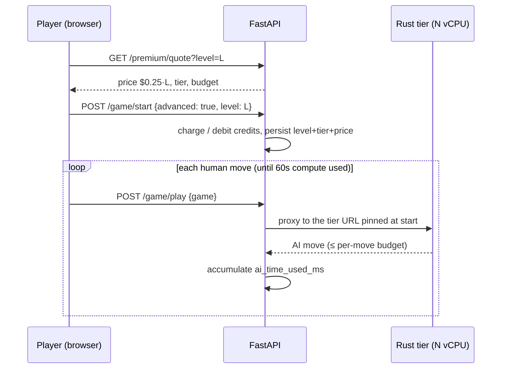

# Advanced Mode — Premium vCPU Pricing

## Goal

Let players who want the strongest opponent enable **Advanced Mode**: the game is played against the Rust engine (`gomoku-httpd-rust`) on a dedicated high-vCPU Cloud Run instance, with a user-selected **performance level from 0 to 20**, and a per-game price computed from that level. The game's total AI compute is capped at **60 seconds**; the price is charged per game, up front.

## Pricing facts (researched 2026-06)

Cloud Run has no selectable CPU SKU; "highest performance" means the gen2 execution environment with dedicated (non-throttled) CPU. Tier-1 region, request-based billing:

| Resource | Price |
| -------- | ----- |
| vCPU | $0.000024 per vCPU-second |
| Memory | $0.0000025 per GiB-second |

Our tiers allocate N/2 GiB per N vCPUs, so the cost of an N-vCPU instance is:

```
cost_per_second(N) = 0.000024·N + 0.0000025·(N/2) = $0.00002525 · N
```

A full 60-second game therefore costs us:

```
C(N) = 60 · 0.00002525 · N ≈ $0.0015 · N
```

| N vCPU | cost/sec | cost/60s game |
| ------ | -------- | ------------- |
| 2 | $0.0000505 | $0.0030 |
| 4 | $0.000101 | $0.0061 |
| 8 | $0.000202 | $0.0121 |
| 20 (hypothetical) | $0.000505 | $0.0303 |

## The pricing formula

⚠️ **The two stated constraints contradict each other, by ~100×.** "Cost + 50%" yields $0.005–$0.045 per game; the desired range is $0.50–$5.00. Sixty seconds of cloud CPU is simply that cheap. We resolve the contradiction by treating *the range* as the requirement and *cost + 50%* as a safety floor:

```
P(L) = max( $0.25 × L,  1.5 × C(L) )      for level L ∈ [2, 20]
     = $0.25 × L                           (the floor never binds today)
```

This lands exactly on the requested range — **L=2 → $0.50, L=20 → $5.00** — with a gross margin ≥ 99% at every level. The `1.5 × C(L)` floor only activates if the coefficient is ever slashed or the compute cap grows ~70×.

## Platform constraint: Cloud Run caps at 8 vCPU

Cloud Run services allow at most **8 vCPU** per instance (allowed values 1, 2, 4, 6, 8). A literal "level = vCPUs up to 20" is not deployable on Cloud Run. Levels therefore map to a **(vCPU tier, per-move time budget)** pair — strength above 8 vCPU comes from more thinking time, which for a single-position search is an honest substitute for parallelism:

| Level L | vCPU tier | per-move budget (ms) |
| ------- | --------- | -------------------- |
| 0–1 | free C engine | n/a (depth-based) |
| 2–3 | 2 | 250 · L |
| 4–7 | 4 | 250 · L |
| 8–11 | 6 | 250 · L |
| 12–20 | 8 | 250 · L (max 5000) |

Going truly beyond 8 vCPU (GCE managed instance group or GKE) is an explicit **non-goal** of this feature; the level→tier table localizes that future change to one map.

## Game flow



## Functional requirements

1. **Mode selection.** `ChooseGameTypeModal` gains an "Advanced Mode" option with a 0–20 performance slider and a live price readout (`$0.25 × L`, formatted). Levels 0–1 display "Free" and use the C engine.
1. **Quote before charge.** The price shown is computed server-side (`GET /premium/quote`); the client never computes money.
1. **Tier pinning, not instance pinning.** The engine is stateless (the full game JSON travels with every move), so what must stay constant for the whole game is the **tier service** (its vCPU size is fixed at deploy time). The api resolves the tier URL from `GOMOKU_RUST_ENGINE_URLS` at game start and stores it on the game row; every subsequent move routes there. `max_instance_request_concurrency = 1` already gives each in-flight move a whole instance.
1. **60-second compute cap.** Cumulative engine think-time per game is metered by the api; when exhausted, subsequent AI moves run at the engine's minimal-effort setting (instant), and the UI shows "boost spent".
1. **Per-move budget.** The api passes `max_time_ms = 250·L` (cap 5000) to the Rust engine on every move.
1. **Pricing config.** The `$0.25` coefficient lives in Terraform (`premium_level_coefficient`, replacing #120's `premium_vcpu_coefficient = 0.5`) and flows to the api as an env var. One knob.

## Non-goals

- Payment processing (Stripe/credits ledger) — separate feature; this one computes, displays, and records the price, and gates Advanced Mode behind a feature flag until payments land.
- vCPU tiers above 8 (GCE/GKE backends).
- Changing the free C-engine experience.

## Quality bar

- Pricing function is pure, unit-tested at every level 0–20, and is the **single** source of the number shown in the UI and stored on the game.
- e2e: start an Advanced game at L=4 in the browser, verify the quoted price, the tier routing (Honeycomb span attribute), and the budget exhaustion path.

## Related

- `.features/010.realtime-websocket-push-architecture/` (transport changes are orthogonal)
- PR #120 — premium Rust tiers on Cloud Run (`rust_tiers`, `GOMOKU_RUST_ENGINE_URLS`, IAM-only invoker)
