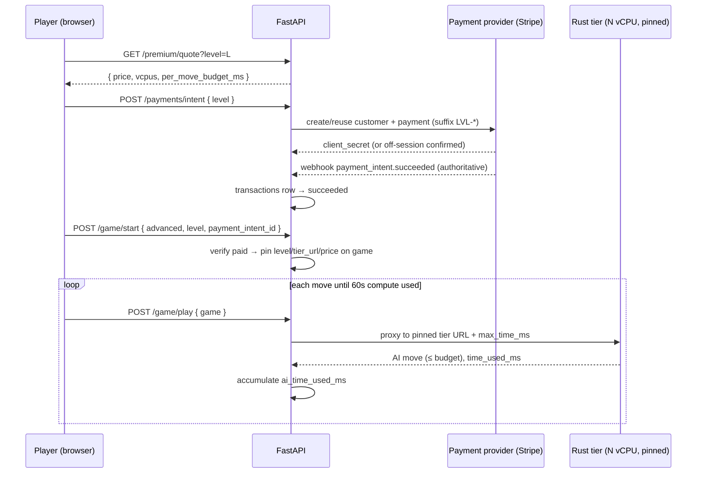

# Premium Advanced Mode — Rust engine vCPU tiers + paid play

> **Reconciled, consolidated spec.** This single directory replaces the earlier
> split between `.features/000.rust-based-game-brain/` (removed) and the prior
> contents of this `011` directory from PR #121. It merges the best of three
> sources:
>
> - **PR #121** (this directory's prior _Advanced Mode premium vCPU pricing_) —
>   the 0–20 performance-level model, pricing research, and the 8-vCPU Cloud Run
>   reality.
> - **PR #120** (_Premium Rust engine tiers on Cloud Run_) — the deployed
>   infrastructure (`rust_tiers`, `GOMOKU_RUST_ENGINE_URLS`, IAM-only invoker).
> - **Feature 000's draft** (removed) — the provider-agnostic payments
>   architecture that #121 explicitly deferred.
>
> On merge this is the single authoritative premium spec; **PR #121 is
> superseded** (its design is absorbed and extended here with payments).

## Goal

Let players pay for the strongest possible opponent. **Advanced Mode** plays the
game against the Rust engine (`gomoku-httpd-rust`) on a dedicated, non-throttled,
multi-vCPU Cloud Run instance. The user picks a **performance level 0–20**; the
price is computed from that level and charged **per game, up front**, through a
**provider-agnostic payment layer** (Stripe first). Total AI compute per game is
capped at **60 seconds**. Free play (levels 0–1) continues to use the
single-vCPU C engine, unchanged.

## Why the Rust engine

The Rust engine parallelizes a single move's root search across cores with
`rayon` (`gomoku-httpd-rust/src/ai.rs`), so additional vCPUs genuinely speed up
/ deepen one move — unlike the single-threaded C engine. More compute buys a
stronger opponent, which is the thing being sold.

## Performance levels and tier mapping

A single 0–20 level is the only knob the user sees. It maps server-side to a
`(vCPU tier, per-move time budget)` pair. **Cloud Run caps a service at 8 vCPU**
(allowed 1/2/4/6/8), so strength above 8 vCPU comes from more *thinking time*,
not more cores — an honest substitute for a single-position search.

| Level L | vCPU tier | per-move budget |
| ------- | ---------------- | --------------- |
| 0–1 | free C engine | depth-based (n/a) |
| 2–3 | 2 vCPU | `250·L` ms |
| 4–7 | 4 vCPU | `250·L` ms |
| 8–11 | 6 vCPU | `250·L` ms |
| 12–20 | 8 vCPU | `250·L` ms (cap 5000) |

Going beyond 8 vCPU (GCE MIG / GKE) is an explicit **non-goal**; the level→tier
table localizes that future change to one map.

## Pricing

Researched 2026-06 against official GCP Cloud Run pricing (Tier-1,
request-based): vCPU `$0.000024`/vCPU-s, memory `$0.0000025`/GiB-s. With
`N/2` GiB per `N` vCPU, a 60-second game costs us `C(N) ≈ $0.0015·N` — i.e. a
fraction of a cent. The requested "cost + 50%" and "$0.50–$5.00 range" disagree
by ~100×; we treat the **range as the requirement** and cost+50% as a floor:

```
price(L) = max( $0.25 × L , 1.5 × C(level→vcpu(L)) )   for L ∈ [2,20]
         = $0.25 × L          (the floor never binds at today's cap)
```

→ **L=2 → $0.50 … L=20 → $5.00**, ≥99% gross margin. The `$0.25` coefficient
lives in Terraform (`premium_level_coefficient`, replacing #120's
`premium_vcpu_coefficient`) and flows to the API as one env var. The price is
**computed server-side** (`GET /premium/quote`); the client never computes money.

## Compute cap and per-move budget

- **60-second cumulative cap** per game, metered by the API
  (`ai_time_used_ms`). Once exhausted, further AI moves run at the engine's
  instant/minimal setting and the response carries `boost_spent: true`.
- **Per-move budget** `max_time_ms = 250·L` (cap 5000) is passed to the Rust
  engine on every move; the engine honors it in its iterative-deepening cutoff
  and reports `time_used_ms`.

## Payments (the part #121 deferred)

Charged **per game, up front**, via a **provider-agnostic** layer so a second
processor (e.g. Adyen) can be added without touching call sites — mirroring the
repo's existing selectable `email_provider` backends (PR #118).

- **No card data stored.** The processor vaults the card; we persist only the
  processor's anonymous **customer ID**, always together with its provider
  (PCI SAQ-A). On return visits we charge that saved customer **off-session**;
  Stripe's `setup_future_usage='off_session'` enables this, falling back to an
  on-session confirmation only when SCA/3DS (`authentication_required`) demands.
- **Authoritative via webhook.** The processor webhook (signature-verified over
  the raw body) is the source of truth that a charge succeeded — never the
  client. Charges are idempotent on `(provider, external_payment_id)`.
- **Statement descriptor.** Static `GOMOKU` (dashboard) + a per-charge dynamic
  suffix via the writable `statement_descriptor_suffix` (not the read-only
  `calculated_statement_descriptor`), e.g. `GOMOKU* LVL-FAST`.
- **Entitlement is DB-authoritative.** A succeeded charge writes a
  `transactions` row; `/game/start` verifies it and pins the level/tier/price
  on the game row. The client-supplied "premium" flag is informational only.
- **Feature-flagged.** `PREMIUM_ENABLED` (default off in production) gates the
  mode until the full payment path is verified.

## Security & isolation

- **Cloud Run IAM** (the existing `GCPIdentityAuth` ID-token mechanism) protects
  every engine call; the services run `ingress=ALL` + IAM invoker, so
  non-token callers get 403. The originally-proposed OpenSSL/bcrypt entrypoint
  is unnecessary and dropped.
- **Tier pinning, not container pinning.** The engine is stateless (the whole
  game JSON travels with each move). What stays constant per game is the **tier
  service URL**, resolved from `GOMOKU_RUST_ENGINE_URLS` at start and stored on
  the game row. `max_instance_request_concurrency = 1` already gives each
  in-flight move a whole instance; each tier scales to zero when idle.

## Game flow



## Functional requirements

1. **Mode selection.** `ChooseGameTypeModal` gains an "Advanced Mode ⚡" option
   with a 0–20 slider and a live, server-quoted price; levels 0–1 show "Free".
1. **Quote before charge.** `GET /premium/quote` returns the price; the client
   never computes money.
1. **Payment.** First-time card via the embedded Stripe Payment Element;
   returning customers charged off-session against the saved customer ID.
1. **Entitlement & pinning.** A verified paid `transactions` row lets
   `/game/start` pin `premium_level`, `premium_tier_url`, `price_cents`.
1. **Routing & budget.** `/game/play` routes premium games to the pinned tier
   URL, passes `max_time_ms`, accrues `ai_time_used_ms`, flips to instant +
   `boost_spent` past 60 000 ms.
1. **One pricing knob.** `premium_level_coefficient` in Terraform → API env.

## Non-goals

- vCPU tiers above 8 (GCE/GKE backends).
- Subscriptions or stored card data (one-off charges; processor vaults the card).
- Changing the free C-engine experience.
- Real-time transport changes (see Feature 010).

## Quality bar

- Pricing is a pure, unit-tested function (all 21 levels, golden $0.50…$5.00)
  and the single source of the number shown and stored.
- Payment path covered by tests in processor test mode incl. the 3DS/off-session
  fallback and idempotent webhook replay.
- e2e: buy an Advanced game at L=4 (test card) → quoted price matches, tier
  routing visible in a Honeycomb span, budget-exhaustion path works.

## Related

- PR #120 — premium Rust tiers on Cloud Run (infrastructure this builds on).
- PR #121 — superseded; its Advanced Mode spec/plan are reconciled into this
  directory.
- PR #118 — selectable email-provider backends (the pattern the payment layer copies).
