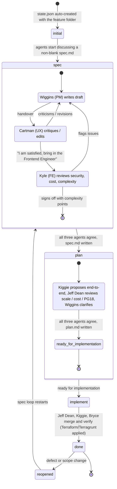

# Feature State Management

Every feature folder `.features/NNN.<slug>/` carries a `state.json` file that tracks the feature's journey from a loose idea to shipped code. Because the AI authors `spec.md` from loosely and often ambiguously defined features, the state file records how many times the spec has been criticized, revised, and handed over between agents — making the authoring loop auditable.

The file is deliberately **self-sufficient for an orchestrating AI agent**: reading `state.json` alone tells the orchestrator which sub-agents to spawn (each stage embeds full agent definitions — name, personality, responsibilities, expertise, authority), how those agents interact (`protocol.interaction`, `protocol.satisfaction_phrase`), and exactly when the feature is considered ready for implementation (`protocol.exit_criteria`, which sets the plan stage's sub-state to `ready_for_implementation` and advances the global state to `implement`).

This folder contains:

| File | Purpose |
| -------------------- | ------------------------------------------------------------------------ |
| `state.schema.json` | JSON Schema (draft 2020-12) that every `state.json` must validate against |
| `state.example.json` | Sample state for the feature "Implement Authentication and Authorization", captured mid-planning |

## Lifecycle

1. **The Idea.** A human, the AI, or both propose a feature in a chat-like conversation.
1. **Naming.** Both agree the feature is worth building and agree on a name, which yields the folder, e.g. `./.features/012-chat-between-engaged-players/{spec,plan}.md`.
1. **Overview.** The chat that preceded the folder's creation is saved to `overview.md` inside it. `state.json` is created automatically with global state `initial`.
1. **Spec stage.** Three agents collaborate on `spec.md`; the moment they begin discussing a non-blank `spec.md`, the global state becomes `spec`:
   - **Wiggins (Product Manager)** — the main agent; resolves all disagreements.
   - **Cartman (UX Designer)** — represents the user; flags UX issues or directly edits the spec with known design patterns.
   - **Kyle (Senior Frontend Engineer)** — hunts security holes and "impossibilities", and signs off with a complexity estimate: 1 point ≈ 2 hours, 2 points ≈ 2/3 of a day, 3 points ≈ one day; points are additive, so 15 points ≈ one engineer-week.
     Wiggins and Cartman iterate until each says *"I am satisfied with this specification, let's bring in the Frontend Engineer"*. Kyle then reviews complexity, third-party tooling (e.g. Redis), cost, and security (CORS, secret/password encryption, modern methods such as JWT), appending discoveries to `spec.md`.
1. **Plan stage.** Three agents debate `plan.md` and the global state becomes `plan` (sub-state `planning_in_progress`):
   - **Wiggins (Product Manager)** — same agent as before; answers and clarifies questions.
   - **Jeff Dean (Senior Superstar Engineer)** — extremely senior across frontend and backend; catches scaling-to-millions issues, keeps costs low, insists on UUID primary keys, FK and check constraints, and proposes advanced PostgreSQL 18 features.
   - **Kiggie (Frontend Super-smart Engineer)** — younger, IQ 180, math-olympiad winner; proposes the solution end-to-end with the most current React/tooling practices.
     The resulting `plan.md` outlines step-by-step implementation, Honeycomb telemetry integration, logging, and the infrastructure to run and deploy on. When the plan is agreed, the plan stage's sub-state becomes `ready_for_implementation` and the global state advances to `implement`.
1. **Implementation, done, reopened.** The implementation team — **Jeff Dean** (lead, backend/database), **Kiggie** (frontend), and **Bryce** (full-stack, DevOps-savvy engineer; master of Terraform and Terragrunt, both of which we use) — lands the code, which is verified (`implement` → `done`); a shipped feature can be `reopened`, which sends it back through the spec loop.

## State transitions



## What `state.json` records

- **`state`** — the global lifecycle state: `initial`, `spec`, `plan`, `implement`, `done`, or `reopened`.
- **`history`** — an append-only log of global state transitions (who, when, why).
- **`stages.<state>`** — one hash per stage tracking:
  - `current_agent` — who currently holds the pen (null when the stage is inactive);
  - `agents` — the full sub-agent roster, keyed by agent id. Each entry is both the **spawn definition** (`name`, `role`, `personality` — usable verbatim as the sub-agent's system prompt — `responsibilities`, `expertise`, `authority`) and the **runtime state** (`satisfied`, `sign_off_at`, per-agent criticism/revision counts). `authority` distinguishes the `final_arbiter` (the Product Manager, who resolves all disagreements), `sign_off` agents (whose explicit approval gates stage exit, e.g. the Frontend Engineer's complexity estimate), and plain `contributor`s;
  - `protocol` — the rules of engagement: `entry_agent` (who opens the stage), the ordered `interaction` steps, the exact `satisfaction_phrase` an agent must utter to flip its `satisfied` flag, an optional `max_rounds` safety valve, and `exit_criteria` (`all_agents_satisfied` + `artifacts_written` + `required_sign_offs` → `set_sub_state` / `advance_global_state_to`);
  - `counters` — stage totals for criticisms, revisions, handovers, and discussion rounds;
  - `handovers` — the chronological hand-over chain between agents;
  - `artifacts` — the markdown files the stage produces (`overview.md`, `spec.md`, `plan.md`);
  - `complexity_points` — the Frontend Engineer's additive estimate, recorded at spec sign-off;
  - `sub_state` — finer-grained labels such as `planning_in_progress` / `ready_for_implementation`.

A stage's `status` walks `not_started` → `in_progress` → `agreed` (all agents satisfied and the artifact written) → `complete` (the global state has moved on).

### Readiness for implementation, precisely

The feature is **ready for implementation** at the moment the plan stage's `exit_criteria` are all met: every plan agent (`wiggins`, `jeff-dean`, `kiggie`) has `satisfied: true`, `plan.md` exists and is non-blank, and the required sign-offs are timestamped. The orchestrator then writes `stages.plan.sub_state = "ready_for_implementation"` and advances the global `state` to `implement`. The implementation roster (`jeff-dean`, `kiggie`, `bryce`) is already defined in `stages.implement.agents`, so the orchestrator can spawn the team straight from the file.

## Validating

```bash
# Node (ajv-formats is required for the date-time format)
npx -p ajv-cli -p ajv-formats ajv validate --spec=draft2020 -c ajv-formats \
  -s .features/state-management/state.schema.json \
  -d .features/011.implement-authentication-and-authorization/state.json

# Python
python -c "import json, jsonschema; jsonschema.validate(json.load(open('state.json')), json.load(open('state.schema.json')))"
```
