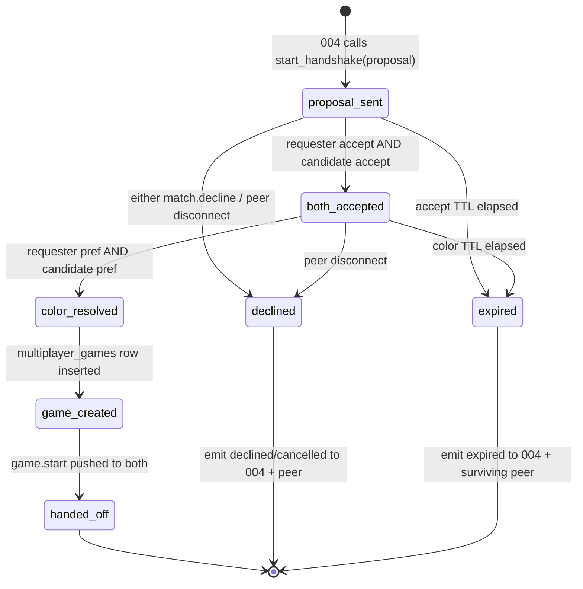

# 005 — Match Ready + Color Negotiation: Architecture Plan

> Authored against the real codebase: `api/app/routers/multiplayer.py`,
> `api/app/multiplayer/allocate.py`, `api/app/multiplayer/db.py`,
> `api/app/models/multiplayer.py`, `frontend/src/components/`. WS envelope
> and channel conventions follow 002 as referenced by 006
> (`.plans/006-chat-simplification/plan.md` — `{type, payload, v}`,
> `wsClient.subscribe(channel, cb)`, reserved `match.*` / `game.*`).

## Architecture decision

005 inserts a small, in-memory **handshake coordinator** between 004's
proposal and the existing game-creation code. Key choices:

1. **Ephemeral, not persisted.** The handshake lives only as a
   server-side object keyed by `match_id`. Nothing hits the DB until both
   players have accepted and picked colors. This avoids leaking
   half-formed `waiting` rows for matches that never start and keeps the
   `multiplayer_games` table meaning "a real game" for match-born games.
1. **Reuse `allocate_game` + the join transition, factored.** A
   match-born game is created in one shot: row inserted *already*
   `in_progress`, with both `host_user_id` and `guest_user_id` set and
   `host_color` fixed by the resolution. We factor the "go live" SQL out
   of `update_join_game` so both the invite-join path and the match path
   share the `state='in_progress' + version bump` logic. We do **not**
   reuse the 6-char-code-handout / guest-poll-to-join choreography — there
   is no waiting period in a match.
1. **Injectable RNG.** All randomness flows through a single
   `Resolver(rng)` so tests pin outcomes. Default RNG is
   `random.SystemRandom()`; tests inject a seeded `random.Random(seed)`.
1. **WS-driven, HTTP-free handshake.** Every handshake message is a WS
   frame (002). No new REST endpoints. The only HTTP that remains in this
   flow is the existing move POST, after the game starts.

## Handshake state machine



Per-side sub-state the coordinator tracks for each of the two seats:
`pending → accepted → color_picked` (or `declined`). The machine advances
only when **both** seats reach the same milestone; a single seat's update
is idempotent (double-Yes / double color-pick = no-op).

## WS message types

All frames use 002's envelope `{type, payload, v}`. `match.*` and
`game.*` are reserved namespaces 002 hands to 005.

| Type | Direction | Payload |
| --- | --- | --- |
| `match.proposal` | server → both | `{match_id, role: "requester"\|"candidate", peer_username, peer_elo, prompt}` |
| `match.accept` | client → server | `{match_id}` |
| `match.decline` | client → server | `{match_id}` |
| `match.color_pref` | client → server | `{match_id, pref: "black"\|"white"\|"dontcare"}` |
| `match.await_color` | server → both | `{match_id}` (signals "both accepted, show color buttons") |
| `match.declined` | server → surviving side | `{match_id, reason: "declined"\|"cancelled"\|"peer_offline"}` |
| `match.expired` | server → surviving side | `{match_id, reason: "accept_timeout"\|"color_timeout"}` |
| `match.resolved` | server → both | `{match_id, your_color: "X"\|"O", dice: bool, dice_message: string\|null}` |
| `game.start` | server → both | `{game: <MultiplayerGameView JSON>, your_color: "X"\|"O"}` |

`prompt` carries the verbatim Step-1 string already interpolated
server-side (requester vs. candidate wording from spec). `dice_message`
is the verbatim dice-loss string for the loser, `null` otherwise.
`match.resolved` is fired immediately before `game.start` so the modal can
show the dice-loss line for a beat before redirecting.

> Coordinate the exact `type` literals with 002 before merge — 002 owns
> the registry of reserved namespaces. **OPEN.**

## Color-resolution algorithm (seeded RNG)

```python
# api/app/match/resolver.py
from __future__ import annotations
import random
from dataclasses import dataclass
from typing import Literal

Pref = Literal["black", "white", "dontcare"]
Color = Literal["X", "O"]   # X = black = moves first

DICE_LOSS_MESSAGE = "We rolled the dice, sorry — they won."

@dataclass(frozen=True)
class Resolution:
    requester_color: Color
    candidate_color: Color
    dice: bool
    # username of the player who must see DICE_LOSS_MESSAGE, or None
    dice_loser: str | None

class Resolver:
    def __init__(self, rng: random.Random | None = None) -> None:
        self._rng = rng or random.SystemRandom()

    def _coin(self) -> bool:
        return self._rng.random() < 0.5

    def resolve(
        self, requester_pref: Pref, candidate_pref: Pref,
        requester_username: str, candidate_username: str,
    ) -> Resolution:
        BLACK: Color = "X"
        WHITE: Color = "O"

        # Rows 1 & 5: both want the same definite color -> coin flip,
        # loser sees the dice message.
        if requester_pref == candidate_pref and requester_pref in ("black", "white"):
            req_wins = self._coin()
            wanted: Color = BLACK if requester_pref == "black" else WHITE
            other: Color = WHITE if wanted == BLACK else BLACK
            if req_wins:
                return Resolution(wanted, other, True, candidate_username)
            return Resolution(other, wanted, True, requester_username)

        # Row 9: both don't care -> coin flip, silent (no dice message).
        if requester_pref == "dontcare" and candidate_pref == "dontcare":
            req_black = self._coin()
            return Resolution(BLACK if req_black else WHITE,
                              WHITE if req_black else BLACK, True, None)

        # Rows 2,3,4,6,7,8: exactly one assignment satisfies -> deterministic.
        # The side with a definite preference pins it; dontcare takes the rest.
        if requester_pref != "dontcare":
            req: Color = BLACK if requester_pref == "black" else WHITE
            return Resolution(req, WHITE if req == BLACK else BLACK, False, None)
        # requester is dontcare, candidate is definite
        cand: Color = BLACK if candidate_pref == "black" else WHITE
        return Resolution(WHITE if cand == BLACK else BLACK, cand, False, None)
```

This maps 1:1 to the 9-row truth table in `spec.md`. Every branch is
covered by a pytest case with a seeded `random.Random` so the coin
outcomes are deterministic.

## Reuse plan for `multiplayer_games` creation

Today two callers create rows via `allocate_game`
(`api/app/multiplayer/allocate.py`): `POST /multiplayer/new` and the chat
invite path. They insert a `waiting` row; the guest later flips it to
`in_progress` via `update_join_game` (`api/app/multiplayer/db.py:82`).

For a match there is **no waiting period** — both players are known and
both colors are fixed at insert time. Plan:

1. **Factor the "go-live" mutation.** `update_join_game`
   (`db.py:82`) currently does: set `guest_user_id`, set `host_color`,
   `state='in_progress'`, bump `version`. Extract a private
   `_go_live_sql` / a new `db.create_live_match_game(conn, *, host_user_id, guest_user_id, host_color, board_size)` that inserts a
   row **directly** as `in_progress` with both ids and the resolved
   `host_color`, then creates the paired `chats` row (mirroring
   `allocate_game`'s eager chat insert at `allocate.py:86-90`). Keep
   `update_join_game` working for the invite flow; share the chat-insert
   and version semantics, not the code-handout.
1. **Code generation reuse.** Match games still need a unique `code`
   (FK/URL key, `NOT NULL UNIQUE`). Reuse `new_code()` +
   the savepoint-retry loop already in `allocate_game`
   (`allocate.py:60-96`). Cleanest factoring: pull the retry loop into a
   helper `allocate_code(conn, insert_fn)` that takes the row-insert
   callback, so both `allocate_game` (waiting insert) and the new match
   insert share collision-retry without duplicating it.
1. **`created_via` discriminator.** Add `'match'` to
   `MultiplayerCreatedVia` (`api/app/models/db_tables.py`) and to the
   migration's `created_via` CHECK (the column was added in
   `20260501-160000-add-created-via-to-multiplayer-games.py`). A new
   migration `20260609-000000-add-match-created-via.py` widens the CHECK
   to `('modal','invite','match')`. **OPEN:** confirm the existing CHECK
   name before `DROP CONSTRAINT`.
1. **Host = black.** Whoever the resolver assigns `X` becomes
   `host_user_id` with `host_color='X'`; the other is `guest_user_id`.
   This keeps `_participant_color` / `_opposite_color` /
   `_write_finished_games_rows` in `multiplayer.py` working unchanged —
   they already derive everything from `host_color`.

The post-game Elo + history-row writing
(`_write_finished_games_rows`, `multiplayer.py:201`) is **fully reused**
as-is; a match game finishes exactly like an invite game.

## File-by-file (real paths)

### Backend

- **`api/app/match/__init__.py`** — new package.
- **`api/app/match/resolver.py`** — `Resolver`, `Resolution`, `Pref`,
  `DICE_LOSS_MESSAGE` (above). Pure, no I/O, fully unit-testable.
- **`api/app/match/handshake.py`** — `MatchHandshake` (the in-memory state
  machine) + `HandshakeRegistry` (keyed by `match_id`). Methods:
  `start(proposal)`, `on_accept(user_id)`, `on_decline(user_id)`,
  `on_color_pref(user_id, pref)`, `on_disconnect(user_id)`,
  `on_accept_timeout()`, `on_color_timeout()`. Emits via an injected
  `send(user_id, frame)` callable (002's per-user push) and an injected
  `notify_matchmaker(match_id, outcome)` callable (004's hook). RNG /
  resolver injected.
- **`api/app/match/messages.py`** — the verbatim prompt/dice strings and
  frame builders, so copy lives in one place.
- **`api/app/multiplayer/db.py`** — add `create_live_match_game(...)`;
  refactor shared chat-insert + version semantics out of
  `update_join_game`.
- **`api/app/multiplayer/allocate.py`** — extract `allocate_code(conn, insert_fn)` retry helper; `allocate_game` and the match insert both use
  it.
- **`api/app/models/db_tables.py`** — add `MATCH = "match"` to
  `MultiplayerCreatedVia`.
- **`api/app/routers/multiplayer.py`** — add an internal
  `create_match_game(conn, *, requester_id, candidate_id, host_color, board_size)` that calls `create_live_match_game` and returns a
  `MultiplayerGameView` via the existing `_build_view`. The handshake
  coordinator calls this on `color_resolved`. No new HTTP route.
- **`api/db/migrations/versions/20260609-000000-add-match-created-via.py`**
  — widen the `created_via` CHECK to include `'match'`.
- **Wiring into 002:** 002's WS dispatcher routes `match.accept` /
  `match.decline` / `match.color_pref` frames to the
  `HandshakeRegistry`. 004 calls `registry.start(proposal)`. These two
  call sites are the only glue; coordinate the import direction so 002
  doesn't hard-depend on 005 (002 exposes a dispatch hook, 005 registers
  a handler). **OPEN.**

### Frontend

- **`frontend/src/components/MatchReadyModal.tsx`** — new. Renders the
  three handshake phases: (1) Ready? prompt with Yes/No, (2) the three
  color buttons, (3) the dice-loss line. Subscribes to the `match:*`
  frames via 002's `wsClient.subscribe`. On `game.start`, navigates into
  the game (`/play/{code}` or the SPA's in-place game view — mirror
  `ChooseGameTypeModal.tsx`'s post-join navigation, around line 40/89).
  Visual polish is 007's; this component owns only the state/transitions
  and the verbatim copy.
- **`frontend/src/hooks/useMatchHandshake.ts`** — new. Encapsulates the
  WS subscription + the `match.accept` / `match.color_pref` send calls and
  exposes `{ phase, prompt, peer, onYes, onNo, onPickColor, resolved }`
  to the modal. Keeps the component dumb and unit-testable.
- **`frontend/src/components/ChooseGameTypeModal.tsx`** — when the user
  picks "Play with an Elo-matched human", hand off to the matchmaker (004)
  and mount `MatchReadyModal`. (Exact lobby button wiring is 004/007;
  005 only needs the mount point.)

## Timeout values

- **Accept TTL (Step 1):** **ASSUMPTION:** 20 s. Long enough to notice the
  prompt, short enough that a distracted candidate frees the requester to
  re-match quickly.
- **Color-pick TTL (Step 2):** **ASSUMPTION:** 15 s. Both already said
  Yes; picking a color is one tap.
- **Disconnect grace:** **ASSUMPTION:** treat a WS close with no
  reconnect within **3 s** as a disconnect-decline (covers brief network
  blips / 002 reconnection). If 002 exposes a presence/heartbeat signal,
  use it instead of a raw socket-close. **OPEN.**

All three are module constants in `handshake.py` so they're trivially
overridable in tests (drive timeouts manually rather than wall-clock).

## Test plan

### pytest — `api/tests/test_match_resolver.py` (pure)

Drive `Resolver.resolve` with a seeded `random.Random` and assert all 9
truth-table rows:

1. Deterministic rows (2,3,4,6,7,8): assert exact `(requester_color, candidate_color)`, `dice is False`, `dice_loser is None` — no seed
   dependence.
1. Conflict rows (1,5): with `random.Random(seed_A)` → requester wins;
   with `random.Random(seed_B)` → candidate wins. Assert the loser equals
   the correct username and `dice is True`. Pick the two seeds by probing
   `random.Random(n).random() < 0.5` so the test documents the chosen
   outcome.
1. Double-don't-care (9): assert `dice is True`, `dice_loser is None`, and
   that both color assignments are opposite and valid; seed both branches.

### pytest — `api/tests/test_match_handshake.py` (state machine)

Inject a fake `send` (records frames per user) and a fake
`notify_matchmaker`. Assert:

1. **Both-accept happy path × each color combo:** start → both accept →
   both color_pref → assert a `multiplayer_games` row exists,
   `state='in_progress'`, both ids set, `host_color` matches the seeded
   resolution, and both users got `game.start` with the correct
   `your_color`. Parametrize over the 9 combos with a seeded resolver.
1. **Decline path:** candidate declines → requester gets `match.declined`
   (`reason='declined'`), `notify_matchmaker` called with `declined`, no
   DB row.
1. **Cancel path:** requester declines → candidate gets `match.declined`
   (`reason='cancelled'`), matchmaker told `cancelled`.
1. **Accept timeout:** fire `on_accept_timeout()` with one side pending →
   surviving side gets `match.expired`, matchmaker told `expired`.
1. **Disconnect = decline:** `on_disconnect(candidate_id)` →
   `match.declined` (`reason='peer_offline'`).
1. **Idempotency / races:** double `on_accept`, double `on_color_pref`,
   and a `decline` arriving after `color_resolved` all leave the terminal
   state unchanged (no second game row, no duplicate `game.start`).

### pytest — `api/tests/test_multiplayer.py` (DB reuse)

Add a case that calls `create_live_match_game` directly and asserts the
row is born `in_progress` with the paired `chats` row present and a unique
`code` — proving the factored helper matches `update_join_game`'s
end-state.

### Cypress (note for 012)

The accept → color → play two-human flow needs 012's two-client harness.
Author `match-handshake.cy.ts` behind an `@012` tag (genuinely
`it.skip`): client A requests human, client B sees the prompt, both Yes,
both pick `dontcare`, assert both land in the same game with opposite
colors (seed the backend RNG via a test-only env knob so the colors are
deterministic). A second test covers B declining → A sees the declined
message.

## Edge cases

- **Simultaneous accept:** both `on_accept` calls land "first"; the
  machine advances to `both_accepted` exactly once (guard on the combined
  predicate, not per-call). Emit `match.await_color` once.
- **Double color-pick:** second `on_color_pref` from the same seat is a
  no-op; resolution fires only when both seats have a pick and only once.
- **Requester cancels after candidate accepted:** candidate gets
  `match.declined(reason='cancelled')`; no DB row; matchmaker told.
- **Candidate disconnects after picking a color but before the row is
  created:** if resolution hasn't fired, treat as decline; if the row was
  already created and `game.start` sent, it's a normal in-game
  disconnect — hand to 009/002, not 005.
- **Decline arriving after `game_created`:** ignored (terminal); the late
  frame is dropped by the registry (match_id already retired).
- **`game.start` delivery fails to one side** (socket closed in the
  window): the row exists and is durable; the reconnecting client
  re-fetches via the existing `GET /multiplayer/{code}` and resumes. No
  rollback. **OPEN:** decide whether to also resend `game.start` on
  reconnect (probably 002's reconnect-replay concern).

## Build sequence

- [ ] **A — resolver:** `api/app/match/resolver.py` + 9-row pytest. No
  deps, fully green standalone.
- [ ] **B — DB factoring:** extract `allocate_code` +
  `create_live_match_game`; add `MATCH` enum + migration; extend
  `test_multiplayer.py`. `just test-api` green.
- [ ] **C — handshake coordinator:** `handshake.py` + `messages.py` with
  injected `send` / `notify_matchmaker` / resolver; full state-machine
  pytest.
- [ ] **D — 002 wiring:** register the `match.*` handlers on 002's
  dispatcher; expose `registry.start` for 004. (After 002 + 004 land.)
- [ ] **E — frontend:** `useMatchHandshake.ts` + `MatchReadyModal.tsx`;
  mount from the lobby. `just test-frontend` green.
- [ ] **F — Cypress:** `match-handshake.cy.ts` behind `@012`, untagged
  once 012's harness exists.

## ASSUMPTION / OPEN

- **ASSUMPTION:** 002 provides per-user push and a dispatch hook 005 can
  register `match.*` handlers on; 004 provides the proposal and a
  `notify_matchmaker` callback for `declined`/`cancelled`/`expired`.
- **ASSUMPTION:** Accept TTL 20 s, color TTL 15 s, disconnect grace 3 s.
- **ASSUMPTION:** the dice-loss string is normalized to
  `"We rolled the dice, sorry — they won."`; the umbrella spec's literal
  "rolled the dice, sorry they won" is the source of truth if the user
  prefers it verbatim.
- **OPEN:** exact `match.*` / `game.start` type literals — coordinate with
  002's reserved-namespace registry.
- **OPEN:** existing `created_via` CHECK constraint name (needed for the
  migration's `DROP CONSTRAINT`).
- **OPEN:** whether `game.start` is re-sent on reconnect or handled by
  002's reconnect-replay.
- **OPEN:** does the "Timed Game" flag ride on 004's proposal (passed
  through here) or get chosen post-match? Affects whether 005 forwards a
  `timed` field into game creation.

## Verifier notes (Jeff Dean)

1. The combined-predicate guard (advance only when *both* seats reach a
   milestone) is the whole correctness story under concurrency — make it a
   single atomic check on the handshake object, and run the coordinator's
   mutations under one asyncio lock per `match_id` so two frames can't
   interleave a read-modify-write.
1. Disconnect-as-decline must not fire after `game_created` — gate it on
   the current state, or you'll emit a spurious `match.declined` for a
   game that already started.
1. The resolver's coin-flip seeds in tests must be chosen by *probing*
   `random.Random(n).random()`, not guessed — otherwise the test asserts
   the wrong winner and rots silently.
1. `create_live_match_game` must create the paired `chats` row in the same
   transaction (like `allocate_game`), or 006's chat panel FK assumption
   breaks for match games.
1. Confirm `host=black` invariant end-to-end: a match where the requester
   resolves to `O` must still produce a row where `host_user_id` is the
   black (`X`) player, so `_write_finished_games_rows` Elo math stays
   correct.
1. The `match_id`-keyed registry must evict terminal handshakes (TTL or
   on terminal transition) so it can't grow unbounded under churn.
