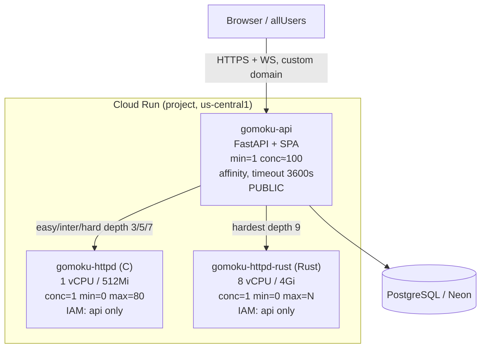

# 011 — Plan: Cloud Run topology & per-game ephemeral Rust backend

## Architecture overview

We extend the existing two-service Cloud Run stack
(`iac/cloud_run/main.tf`: `gomoku-api` + `gomoku-httpd`) with a **third
dedicated service `gomoku-httpd-rust`** sized at 8 vCPU, scaled to zero,
concurrency 1, IAM-restricted to the API. The API gains a `GOMOKU_RUST_URL`
env var (mirroring `GOMOKU_HTTPD_URL`) and an engine resolver that returns the
Rust URL for `difficulty == "hardest"`. "Ephemeral per game" is realized as
**scale-to-zero**: the first move of a Hardest game cold-starts a fresh
8-vCPU instance; when the game ends (or the 15-min cap fires and 008/009
finalize the row), no more moves arrive and Cloud Run idles the instance back
to zero. The teardown call proactively short-circuits routing for that game so
no further requests reach the engine.

### Topology diagram



## Option evaluation: how to make the 8-vCPU Rust backend "ephemeral per game"

### A — Dedicated scale-to-zero Cloud Run service (RECOMMENDED)

One long-lived Terraform-managed `gomoku-httpd-rust` service: `min = 0`,
`cpu = 8`, `concurrency = 1`, IAM-restricted. The service definition is
permanent; **instances** are ephemeral. A Hardest game's first move
cold-starts an 8-vCPU instance; with `concurrency = 1` that instance serves
exactly one game's move stream at a time; when the game ends the instance
idles and Cloud Run scales it to zero within the idle window.

- **Pros:** zero new IAM surface (reuses the existing api→engine invoker
  pattern); no Cloud Run Admin API calls at request time; identical
  build/deploy story to `gomoku-httpd`; cost at rest is **$0** (scale-to-zero,
  no min instances); the resolver is a one-line URL swap. "Destroy
  immediately after game ends" is satisfied by idle-to-zero, and the hard
  ceiling on 8-vCPU spend is the 15-min cap × max-instances.
- **Cons:** not *true* per-game isolation — two simultaneous Hardest games run
  on two **instances of the same service** (fine: `concurrency = 1` keeps
  them on separate instances; `max_instance_count` caps total 8-vCPU fan-out).
  Idle-to-zero is "soon after", not "the instant the game ends" — bounded
  cost, not literal teardown. Cold start of a fresh 8-vCPU Rust instance adds
  latency to the first Hardest move.

### B — Cloud Run Jobs / per-game service via the Admin API

`resolve_engine_url` calls the Cloud Run Admin API to create a uniquely-named
service/job per `game_id`; `teardown_hardest` deletes it.

- **Pros:** literal per-game lifecycle and isolation; teardown is an explicit
  delete; trivially auditable "one resource per game".
- **Cons:** large new IAM surface (the API SA needs `run.admin` +
  `iam.serviceAccountUser` — a privilege escalation we'd rather not grant a
  public service); 30–60s+ provisioning latency per game on top of cold start;
  orphan-cleanup burden if teardown is missed (a crashed API leaks 8-vCPU
  services — exactly the runaway-bill risk we're avoiding); far more moving
  parts for a solo dev to operate. Overkill for beta scale.

### C — Single combined C+Rust container at 8 vCPU

One image with both binaries; one Cloud Run service at 8 vCPU dispatches to
the C or Rust binary per request (spec explicitly allows this).

- **Pros:** one image, one service, simplest Terraform/registry footprint;
  the spec sanctions it.
- **Cons:** **pays 8 vCPU for every easy/intermediate/hard move too** —
  Easy/Inter/Hard are the common path and only need 1 vCPU, so this multiplies
  the baseline AI-move bill ~8×; couples C and Rust release cadence into one
  image; `concurrency = 1` at 8 vCPU for cheap games is wasteful. Good for a
  combined *image* artifact, bad as the *only* service.

### RECOMMENDATION → **Option A**, with the combined image of **Option C** as

the build artifact.

For a solo dev shipping to beta, A is the pragmatic choice: $0 at rest,
no new IAM/privilege surface, identical operational story to the existing
engine, and a hard cost ceiling from the 15-min cap. We **build a single
combined image** (C's `gomoku-httpd` + Rust's `gomoku-httpd-rust` in one
container, per the spec) and deploy it to **two services** with different CPU
sizing and start commands — `gomoku-httpd` invokes the C binary at 1 vCPU,
`gomoku-httpd-rust` invokes the Rust binary at 8 vCPU. This keeps the cheap
path cheap (A) while giving us one artifact to build/push (C's simplicity)
without C's cost penalty.

**Migration path to stricter isolation:** the resolver is the only seam. If
beta demand or abuse requires literal per-game backends, swap the body of
`resolve_engine_url("hardest", …)` from "return the static Rust service URL"
to "create-or-get a per-game service via the Admin API" (Option B) and make
`teardown_hardest` a real delete — no callers change. Document this in the
resolver's docstring.

## The 008 contract implementation (Option A)

Implemented in the API, behind the 008-declared seam (008 calls it; 011 fills
it in). Target file: a new `api/app/engine_resolver.py` (or the module 008
stubs — match whatever 008 lands). Pseudocode:

```python
# api/app/engine_resolver.py
from app.config import settings

# 011 owns this. 008 declares the interface and calls it from /game/move.
def resolve_engine_url(difficulty: str, game_id: str) -> str:
    if difficulty == "hardest":
        # Option A: static scale-to-zero 8-vCPU Rust service. The cold start
        # of a fresh instance IS the per-game provisioning; concurrency=1
        # guarantees one game per instance. game_id is accepted now so the
        # signature survives a future migration to Option B (per-game service).
        return settings.gomoku_rust_url
    return settings.gomoku_httpd_url  # easy / intermediate / hard → C engine

def teardown_hardest(game_id: str) -> None:
    # Option A: nothing to destroy — Cloud Run idles the 8-vCPU instance to
    # zero once the game's move stream stops. This call exists so 008/009 can
    # invoke it on game-end / 15-min cap, and so the Option-B migration has a
    # real delete to hang off. We log it for the audit trail / cost tracing.
    log.info("hardest_teardown", game_id=game_id)
    # No-op under Option A. Under Option B this deletes the per-game service.
```

The Rust service needs its own httpx client/auth or a per-request base-URL
override, because `main.py` today hard-binds one `AsyncClient` to
`settings.gomoku_httpd_url` (line 36-41). Two viable shapes — 011 picks
whichever 008's move handler expects:

- **Two clients:** build a second `httpx.AsyncClient` in `lifespan` bound to
  `settings.gomoku_rust_url` with its own `GCPIdentityAuth(rust_url)`
  (the ID-token audience must match the *target* URL — see `auth_gcp.py`), and
  pick the client by difficulty in the move handler.
- **Per-request base URL:** keep one client but pass the resolved URL +
  per-request `GCPIdentityAuth` token. Two clients is cleaner given the
  audience-bound auth; recommend that.

## Terraform changes — `iac/cloud_run/main.tf` + `variables.tf`

### New service `google_cloud_run_v2_service.rust` (mirror of `httpd`)

Citing the existing `httpd` block (`main.tf` lines 66-123) as the template:

```hcl
locals {
  rust_name = "gomoku-httpd-rust${local.name_suffix}"
}

resource "google_cloud_run_v2_service" "rust" {
  name     = local.rust_name
  location = var.region
  ingress  = "INGRESS_TRAFFIC_ALL"   # same IAM-restricted pattern as httpd

  template {
    scaling {
      min_instance_count = 0                       # ephemeral: scale to zero
      max_instance_count = var.rust_max_instances  # caps concurrent 8-vCPU games
    }
    containers {
      image   = var.rust_image                     # combined image, Rust entrypoint
      ports { container_port = 8787 }
      command = ["./bin/gomoku-httpd-rust"]
      args    = ["-b", "0.0.0.0:8787", "-L", "info"]
      startup_probe { http_get { path = "/health" port = 8787 } ... }
      resources {
        limits = {
          cpu    = "8000m"   # 8 vCPU
          memory = "4Gi"     # memory floor — see note below
        }
      }
    }
    max_instance_request_concurrency = 1
  }
  traffic { type = "TRAFFIC_TARGET_ALLOCATION_TYPE_LATEST" percent = 100 }
  depends_on = [google_project_service.run_api]
}
```

**8-vCPU memory floor:** Cloud Run requires a minimum memory per vCPU; at
8 vCPU the floor is **well above 512Mi** (Cloud Run mandates ≥ ~2Gi for high
CPU and scales the requirement with vCPU; 4Gi is a safe, validated choice that
also gives the depth-9 Rust search headroom). **OPEN:** confirm exact floor
against current Cloud Run limits at `terraform plan` time — bump `memory` if
GCP rejects 4Gi-at-8-vCPU (it won't; the floor is below 4Gi). Also note Cloud
Run gen2 execution environment is required for ≥4 vCPU — set
`template { execution_environment = "EXECUTION_ENVIRONMENT_GEN2" }` if not
default.

### New IAM binding — API invokes Rust (mirror of `api_invokes_httpd`, lines 263-268)

```hcl
resource "google_cloud_run_service_iam_member" "api_invokes_rust" {
  location = google_cloud_run_v2_service.rust.location
  service  = google_cloud_run_v2_service.rust.name
  role     = "roles/run.invoker"
  member   = "serviceAccount:${google_cloud_run_v2_service.api.template[0].service_account}"
}
```

### API env var — inject Rust URL (mirror of `GOMOKU_HTTPD_URL`, lines 153-156)

```hcl
env {
  name  = "GOMOKU_RUST_URL"
  value = google_cloud_run_v2_service.rust.uri
}
```

### API service WS-readiness tweaks (`api` block, lines 131-260)

```hcl
template {
  session_affinity = true          # sticky best-effort routing for WS + polling
  timeout          = "3600s"       # max request/stream timeout for long-lived WS
  max_instance_request_concurrency = 100   # was 80 — toward the 100-conn target
  ...
}
```

(min-instances already = 1 in prod via `var.api_min_instances`.) **ASSUMPTION:**
raising api concurrency to 100 means the httpd/rust max-instance contract noted
in `variables.tf` lines 43-58 becomes `httpd_max_instances >= 100` — bump the
default comment + value accordingly, or document the queueing trade-off.

### New variables — `iac/cloud_run/variables.tf`

```hcl
variable "rust_image" {
  description = "Docker image for gomoku-httpd-rust (depth-9 Rust engine)."
  type        = string
  default     = "placeholder"
}
variable "rust_max_instances" {
  description = "Max concurrent 8-vCPU Hardest games. Cost ceiling: rust_max_instances * 8 vCPU for <=15 min each."
  type        = number
  default     = 3   # conservative beta cap; 3 simultaneous Hardest games
}
```

### Outputs — `iac/cloud_run/outputs.tf`

Add `rust_url` (mirror of `httpd_url`, lines 1-4) →
`google_cloud_run_v2_service.rust.uri`.

## Dockerfile / packaging strategy

**Combined image, two services.** Build one image containing both binaries
(spec sanctions a single container with both). Two real Dockerfiles exist
today:

- `gomoku-c/Dockerfile` — Ubuntu 22.04 builder, `make all`, runs `make test`,
  entrypoint `./bin/gomoku-httpd`.
- `gomoku-httpd-rust/Dockerfile` — `rust:latest`, `just build-release` →
  `bin/gomoku-httpd-rust` (and a `bin/gomoku-httpd` symlink, per
  `gomoku-httpd-rust/justfile` lines 81-85), entrypoint `./bin/gomoku-httpd-rust`.

Strategy: add a **new multi-stage `Dockerfile` at the repo root** (or
`gomoku-c/Dockerfile.combined`) that:

1. Stage 1 builds the C binaries from `gomoku-c/` (`make all`, keep `make test`).
1. Stage 2 builds the Rust release binary from `gomoku-httpd-rust/`
   (`just build-release`).
1. Final stage copies `gomoku-httpd` (C) and `gomoku-httpd-rust` (Rust) into
   one `/app/source/bin/` and leaves the start command to the Cloud Run
   service `command`/`args` (C service → `./bin/gomoku-httpd`, Rust service →
   `./bin/gomoku-httpd-rust`). No `CMD` needed since both services override it.

This yields **one artifact**, deployed to two services at different CPU sizes —
the cheap path stays 1 vCPU (Option A), the artifact is one image (Option C's
simplicity). Keep the existing standalone Dockerfiles for local/dev use.

**OPEN:** if a single combined build is too heavy for CI, fall back to two
separate images (`gomoku-httpd` from `gomoku-c/`, `gomoku-httpd-rust` from
`gomoku-httpd-rust/`) — the Terraform `rust_image` var already supports a
distinct image. Decide at implementation based on build time.

## `bin/deploy` + `iac/cloud_run/deploy.sh` + `just deploy` changes

- **`iac/cloud_run/deploy.sh`** (lines 92-118): add a build+push+digest step
  for the Rust/combined image mirroring the httpd block (lines 93-98):
  ```bash
  RUST_TAG="$REGISTRY/gomoku-httpd-rust:${ENVIRONMENT}"
  docker buildx build --platform linux/amd64 -t "$RUST_TAG" --load <combined-or-rust-context>
  docker push "$RUST_TAG"
  RUST_IMAGE="$(resolve_digest "$RUST_TAG")"
  ```
  Then pass `-var="rust_image=$RUST_IMAGE"` to the final `terraform apply`
  (lines 110-118). If using the combined image, build it once and point both
  `httpd_image` and `rust_image` at the same digest.
- **`bin/deploy`** (lines 127-128): no change needed — it already delegates the
  whole image-build+terraform step to `deploy.sh`. The new `TF_VAR_*` flow
  inside `deploy.sh` keeps `bin/deploy` thin.
- **`just deploy`**: unchanged — it shells `bin/deploy`. Confirm the recipe
  still does (the grep showed only a comment match; verify the recipe body and
  leave it alone if it just calls `bin/deploy`).

## Cost & safety guardrails

- **Scale-to-zero (`min = 0`)** on both engines ⇒ $0 at rest; the always-on
  cost is just the single `gomoku-api` instance (already accepted).
- **`rust_max_instances` cap (default 3)** bounds peak 8-vCPU fan-out: worst
  case 3 × 8 vCPU = 24 vCPU, each for ≤ 15 min.
- **15-min cap as the runaway-bill backstop:** even if a Hardest game's client
  vanishes, 008/009 finalize the row at the cap and `teardown_hardest` fires;
  with no further moves the 8-vCPU instance idles to zero. No game can pin
  8 vCPU indefinitely.
- **`concurrency = 1`** on the Rust service means one 8-vCPU instance can't be
  shared/abused across games; load can't silently amplify per-instance cost.
- Recommend a **GCP billing budget alert** (out-of-band, note in README) so a
  misconfiguration surfaces fast.

## File-by-file (real paths)

| File | Change |
| ---- | ------ |
| `iac/cloud_run/main.tf` | New `gomoku-httpd-rust` service (8 vCPU, min=0, conc=1); new `api_invokes_rust` IAM; `GOMOKU_RUST_URL` env on api; api `session_affinity`/`timeout`/concurrency=100 |
| `iac/cloud_run/variables.tf` | Add `rust_image`, `rust_max_instances`; revisit `httpd_max_instances` comment/default for conc=100 |
| `iac/cloud_run/outputs.tf` | Add `rust_url` output |
| `iac/cloud_run/deploy.sh` | Build/push/digest Rust (or combined) image; pass `rust_image` to apply |
| `Dockerfile` (new, repo root) or `gomoku-c/Dockerfile.combined` | Multi-stage combined C+Rust image |
| `api/app/config.py` | Add `gomoku_rust_url: str = "http://localhost:10001"` (mirror line 65) |
| `api/app/main.py` | Second `httpx.AsyncClient` + `GCPIdentityAuth` bound to rust url (lines 32-41) |
| `api/app/engine_resolver.py` (or 008's stub) | Implement `resolve_engine_url` / `teardown_hardest` |
| `bin/deploy` | No change (delegates to deploy.sh) — verify only |

## Test plan

- **`terraform validate` + `terraform plan`** (staging prefix) — assert the
  new `gomoku-httpd-rust` service plans with `cpu=8000m`, `memory=4Gi`,
  `min=0`, `concurrency=1`, gen2 if required; IAM member present; api env has
  `GOMOKU_RUST_URL`. Plan must be a clean add (no destroy of api/httpd).
- **Staging smoke** (`bin/deploy staging`): start a Hardest game via the API;
  assert a `gomoku-httpd-rust` instance cold-starts and serves a depth-9 move
  (check Cloud Run metrics / Honeycomb trace for the rust span); end the game
  (or hit the 15-min cap) and assert the instance count returns to 0 within
  the idle window. Confirm `teardown_hardest` logs the audit line.
- **Cost assertion:** with no Hardest game running, `gomoku-httpd-rust` shows
  0 instances (verifiable in Cloud Run console / `gcloud run services describe`).
- **012 note:** the e2e Cypress two-human suite runs against the **local
  `gctl` cluster, not Cloud Run** — it does not exercise this topology. 011 is
  validated by `terraform plan` + the staging smoke above, not by 012.

## Edge cases

- **Provision/cold-start failure** (Rust instance fails to start / 5xx): the
  resolver returns the rust URL but the request errors → 008's move handler
  must fall back (surface a clear error, or downgrade — 008 owns the policy).
  011 ensures the failure is observable (startup_probe + Honeycomb span) so the
  fallback path has signal.
- **Two Hardest games at once:** `concurrency = 1` forces them onto two
  separate 8-vCPU instances (good — isolation); `rust_max_instances` caps the
  total. A third simultaneous game beyond the cap queues/cold-starts behind —
  acceptable for beta; raise the cap if it bites.
- **15-min cap teardown:** 008/009 finalize the row → no more moves → instance
  idles to zero. `teardown_hardest` is the explicit hook; under Option A it's a
  logged no-op, under Option B it becomes the real delete.
- **Cold-start latency UX:** a fresh 8-vCPU Rust instance can take several
  seconds to first byte; the first Hardest move is slower than subsequent ones.
  Surface this to 007/008 as "expect a spinner on the first Hardest move".
  Mitigation if it hurts: a small `min_instance_count` on the Rust service
  trades a warm pool for cost — **not** recommended for beta (defeats $0-at-
  rest). **OPEN:** measure cold start in staging; decide if min=0 is acceptable.
- **Orphaned capacity:** under Option A there's nothing to orphan (no per-game
  resource) — the chief reason A beats B for a solo operator.

## Build sequence

1. Add `rust_image` / `rust_max_instances` vars + `gomoku-httpd-rust` service +
   IAM + `rust_url` output + api WS tweaks to Terraform; `terraform validate`.
1. Add the combined Dockerfile (or decide on two images).
1. Wire `deploy.sh` to build/push the Rust image and pass `rust_image`.
1. Add `gomoku_rust_url` to `api/app/config.py`; add the second httpx client to
   `main.py`; implement `engine_resolver.py` against the 008 seam.
1. `bin/deploy staging` → staging smoke (Hardest game provisions + tears down).
1. `bin/deploy production` once staging is green.

## ASSUMPTION / OPEN

- **ASSUMPTION:** Option A (scale-to-zero dedicated service) satisfies
  "destroy immediately after game ends" for beta — idle-to-zero is close
  enough and the 15-min cap bounds worst-case spend. Stricter literal
  per-game teardown (Option B) is deferred behind the resolver seam.
- **ASSUMPTION:** the combined image is the right artifact; if CI build time is
  prohibitive we ship two separate images (Terraform already supports a
  distinct `rust_image`).
- **ASSUMPTION:** raising api concurrency to 100 is the WS-connection target
  from 002/003; the httpd/rust max-instance contract is adjusted to match.
- **OPEN:** exact Cloud Run memory floor + gen2 requirement at 8 vCPU — confirm
  at `terraform plan`; 4Gi/gen2 is the safe starting point.
- **OPEN:** measured cold-start latency of an 8-vCPU Rust instance — decide
  whether min=0 is acceptable UX or a tiny warm pool is worth the cost.
- **OPEN:** whether the API move handler uses two httpx clients or a
  per-request base URL — match 008's actual handler shape.
- **OPEN:** does 008 land `engine_resolver.py` as a stub for 011 to fill, or
  does 011 create it? Coordinate the module name so the seam matches.
